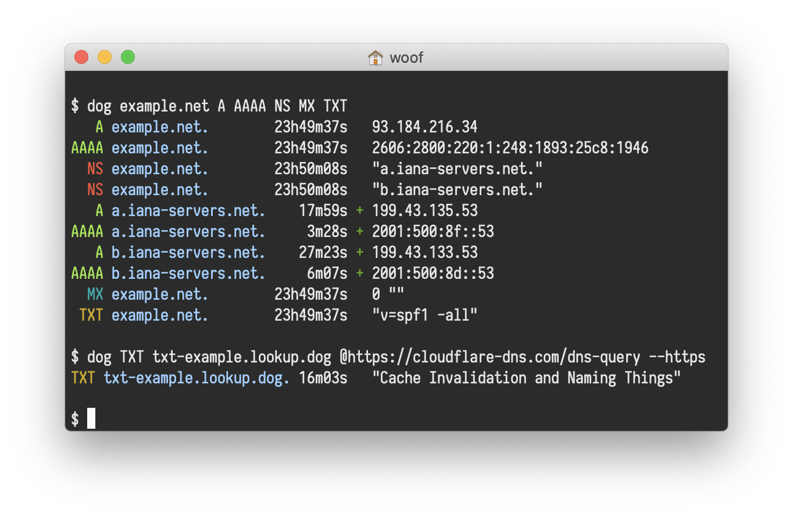

# dog 

Dogs _can_ look up!

**dog** is a command-line DNS client.
It has colourful output, supports the DNS-over-TLS and DNS-over-HTTPS protocols, and can emit JSON.

## Screenshots

## Examples

    dog example.net                          Query a domain using default settings
    dog example.net MX                       ...looking up MX records instead
    dog example.net MX @1.1.1.1              ...using a specific nameserver instead
    dog example.net MX @1.1.1.1 -T           ...using TCP rather than UDP
    dog -q example.net -t MX -n 1.1.1.1 -T   As above, but using explicit arguments

## Options

### Query options

    <arguments>              Human-readable host names, nameservers, types, or classes
    -q, --query=HOST         Host name or IP address to query
    -t, --type=TYPE          Type of the DNS record being queried (A, MX, NS...)
    -n, --nameserver=ADDR    Address of the nameserver to send packets to
    --class=CLASS            Network class of the DNS record being queried (IN, CH, HS)

### Sending options

    --edns=SETTING           Whether to OPT in to EDNS (disable, hide, show)
    --txid=NUMBER            Set the transaction ID to a specific value
    -Z=TWEAKS                Uncommon protocol tweaks

### Protocol options

    -U, --udp                Use the DNS protocol over UDP
    -T, --tcp                Use the DNS protocol over TCP
    -S, --tls                Use the DNS-over-TLS protocol
    -H, --https              Use the DNS-over-HTTPS protocol

### Output options

    -1, --short              Short mode: display nothing but the first result
    -J, --json               Display the output as JSON
    --color, --colour=WHEN   When to colourise the output (always, automatic, never)
    --seconds                Do not format durations, display them as seconds
    --time                   Print how long the response took to arrive

## Installation

Installing dog requires building it from source.

### Compilation

dog is written in [Rust](https://www.rust-lang.org).
You will need a Rust toolchain installed in order to compile it.
To build, download the source code and run:

    cargo build --release

And the binary will be present in `target/release/dog`.

### Testing

dog has an integration test suite written as [Specsheet](https://specsheet.software/) check documents.
If you have a copy installed, you can run:

    just xtests

And it will test the compiled binary by making DNS requests over the network, checking that dog returns results and does not crash.

### Minimum supported Rust version

Currently, dog is built and tested against the most recent stable Rust version, with no compatibility guarantees for any older versions.

Once dog is more mature and development has settled down, a minimum supported Rust version will be chosen.

## Documentation

For documentation on how to use dog, see the website: <https://dns.lookup.dog>

## See also

`mutt`, `tail`, `sleep`, `roff`

## Licence

dog’s source code is under the [MIT Licence](LICENCE).
